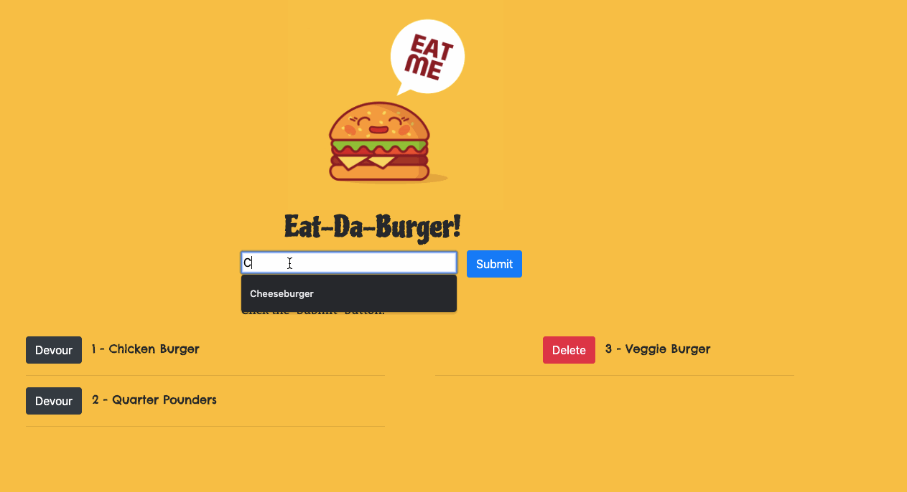

# Unit 13 Node Express Handlebars - Eat-Da-Burger

## Description

In this assignment, you'll create a burger logger with MySQL, Node, Express, Handlebars and a homemade ORM (yum!). Be sure to follow the MVC design pattern; use Node and MySQL to query and route data in your app, and Handlebars to generate your HTML.

## User Story

    AS A restaurant owner
    I WANT to generate an app that lets users input the names of burgers
    SO THAT I know what they would like to eat

## Criteria

    GIVEN three different burgers

    WHEN the user submits the name of a burger
    THEN the app will display that burger on the left side of the page with a devour button
    WHEN the devour button is clicked
    THEN the burger will move to the right side of the page with a delete button
    WHEN the delete button is clicked
    THEN the burger will be permanently removed from the application 

## Heroku Link

The link below will give you access to the web application via the Heroku web service:

## Local Environment Installation

To run the application locally, first clone this repository with the following command: 

    https://github.com/dghazi12/davidaghazi13.github.io.git

Next, install the application dependencies:

    npm install

Lastly, start the application server using the command line below

    node server.js

## Preview

